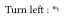

# Typst Lucide

[Lucide](https://lucide.dev) icons (version v0.575.0) for [Typst](https://typst.app).

## Usage

### Install

Download lucide-font at https://github.com/lucide-icons/lucide/releases/, then from the archive install the `.ttf` on your system or in your project folder.

### Use the icon

```typst
#import "@preview/lucide:0.1.0": *

Turn left : #lucide-icon("corner-up-left")
```



## Update

Updating this package is quite easy, you just need to bump the version in the
[`generator.py`](./generator.py) script and then run `uv run python generator.py`.
